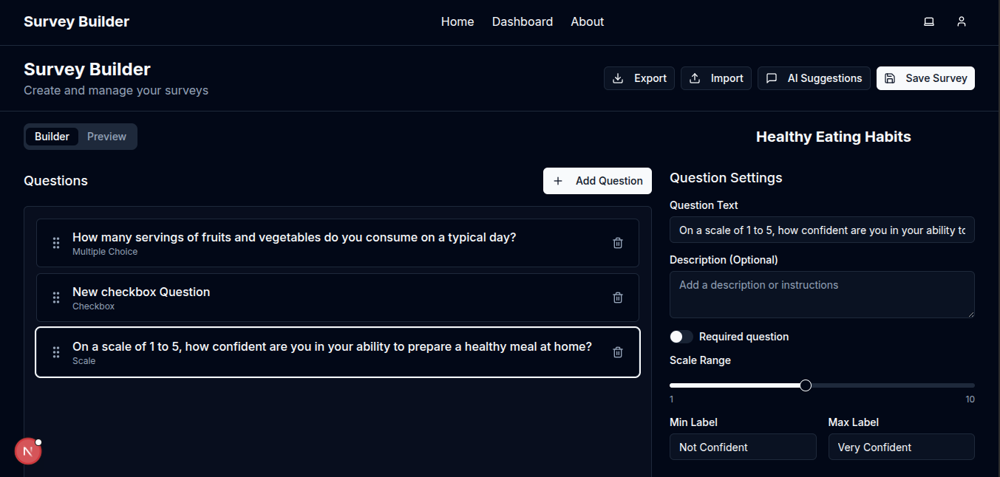

# Survey Builder

A modern, full-featured survey creation and management platform built with Next.js and Supabase.



- **Intuitive Survey Builder**: Drag-and-drop interface for creating surveys with various question types
- **Question Types**: Support for text, multiple-choice, checkbox, dropdown, scale, and date questions

### 🛠️ Admin Panel

- Drag-and-drop interface for adding, removing, and reordering questions.
- Support for diverse question types: text, multiple choice, checkbox, dropdown, scale, and date.
- Conditional logic to dynamically show/hide questions based on user responses.
- Preview mode to test the survey flow in real time.
- Import/export survey templates in JSON format for reuse and sharing.

### ⚡ State Management (Zustand)

- Global state for managing survey structure and metadata (title, description, settings).
- Actions for adding, updating, deleting, and reordering questions.
- Persistent state in local storage for draft recovery.
- Undo/redo functionality for survey edits.

### 🧩 React Hook Form Integration

- Dynamic field rendering based on question type.
- Schema-based validation with Zod for strong TypeScript safety.
- Nested field arrays to support multi-option questions.
- Custom hooks to synchronize form state with Zustand.
- Clear, user-friendly error messages.

### 🧠 TypeScript First

- Strongly typed interfaces for surveys, questions, and responses.
- Discriminated unions for question types to ensure type-safe rendering and validation.
- Generic components for reusable and maintainable form logic.
- Enums for question types and input formats to maintain consistency.
- Zod schemas tightly integrated with question configurations.

### 🎨 Frontend Experience

- UI consistency via component library (Shadcn/UI or MUI).
- Fully responsive and mobile-friendly design.
- Accessibility best practices: ARIA labels, keyboard navigation.
- Lazy-load preview for performance on large surveys.

### 🌟 Additional Capabilities

- AI-powered question suggestions (coming soon).
- Dark mode and customizable themes.
- Secure user authentication and role-based access control.
- Analytics-ready response collection and visualization.

---

## 🧱 Technologies Used

- **Frontend**: Next.js 15, React, Tailwind CSS, Shadcn/UI
- **State Management**: Zustand, React Hook Form
- **Validation**: Zod (with TypeScript)
- **Backend**: Next.js API Routes, Supabase
- **Database**: PostgreSQL via Supabase
- **Auth**: Supabase Auth
- **Drag and Drop**: `dnd-kit`
- **Styling**: Tailwind CSS with theme support

---

## 🚧 Getting Started

### Prerequisites

- Node.js 18.x or higher
- [Bun](https://bun.sh/) installed globally
- Supabase account

### Installation

```bash
git clone git@github.com:rch28/dynamic-survey-builder.git
cd dynamic-survey-builder
bun install

```
